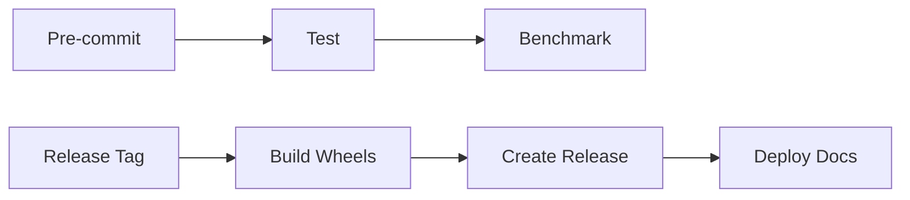

# PCL Rustic - 高性能 Python 点云运算库


**PCL Rustic** 是一个基于 Rust + PyO3 的高性能 Python 点云处理库，使用 [Burn](https://github.com/tracel-ai/burn) 张量框架实现批量运算，支持 CPU/GPU 加速。

## ✨ 核心特性

- 🚀 **高性能批量运算**：基于 Burn 张量框架，支持 CPU/GPU 加速
- 🔗 **零拷贝互通**：与 NumPy 数组无缝转换，支持多种 dtype
- 📦 **多格式 I/O**：LAZ/LAS/Parquet/CSV 格式读写
- 🎯 **类型安全**：完整的类型注解和 `.pyi` 存根文件
- 🧩 **模块化设计**：清晰的 Trait 抽象，易于扩展
- 📊 **性能优异**：10M 点云体素下采样 ~7s，吞吐量 1.3-1.5M pts/s

## 📦 安装

### 使用 uv (推荐)

```bash
uv pip install pcl-rustic
```

### 使用 pip

```bash
pip install pcl-rustic
```

### 从源码构建

```bash
# 克隆仓库
git clone https://github.com/YOUR_USERNAME/pcl-rustic.git
cd pcl-rustic

# 使用 uv 构建
uv build

# 或使用 maturin
pip install maturin
maturin develop --release
```

## 🚀 快速开始

```python
import numpy as np
from pcl_rustic import PointCloud, DownsampleStrategy

# 使用 NumPy 数组创建点云（dtype=float32）
xyz = np.random.randn(10000, 3).astype(np.float32) * 100
pc = PointCloud.from_xyz(xyz)

# 添加属性
intensity = np.random.rand(10000).astype(np.float32) * 255
pc.set_intensity(intensity)

# 体素下采样
pc_downsampled = pc.voxel_downsample(
    voxel_size=0.15,
    strategy=DownsampleStrategy.CENTROID
)

print(f"原始点数: {pc.point_count():,}")
print(f"下采样后: {pc_downsampled.point_count():,}")
```

## 📖 API 文档

### 创建点云

```python
# 从 NumPy 数组创建（推荐）
xyz = np.array([[1.0, 2.0, 3.0], [4.0, 5.0, 6.0]], dtype=np.float32)
pc = PointCloud.from_xyz(xyz)

# 从文件读取
pc = PointCloud.from_las("input.las")
pc = PointCloud.from_csv("input.csv", delimiter=ord(','))
```

### 属性管理

```python
# 设置属性（需要 dtype=float32 的 NumPy 数组）
intensity = np.array([100.0, 200.0], dtype=np.float32)
pc.set_intensity(intensity)

# 获取属性（返回 NumPy 数组）
xyz_arr = pc.get_xyz()        # shape: (N, 3), dtype: float32
intensity_arr = pc.get_intensity()  # shape: (N,), dtype: float32

# 自定义属性
pc.add_attribute("elevation", elevation_data)
pc.set_attribute("classification", class_data)
pc.remove_attribute("elevation")
```

### 坐标变换

```python
# 刚体变换（旋转 + 平移）
rotation = np.eye(3, dtype=np.float32)
translation = np.array([1.0, 2.0, 3.0], dtype=np.float32)
pc_transformed = pc.rigid_transform(rotation, translation)

# 矩阵变换
matrix = np.eye(4, dtype=np.float32)
pc_transformed = pc.transform(matrix)
```

### 下采样

```python
# 体素下采样
pc_down = pc.voxel_downsample(
    voxel_size=0.06,  # 体素大小
    strategy=DownsampleStrategy.CENTROID  # 或 RANDOM
)
```

**采样策略**：
- `DownsampleStrategy.RANDOM`：随机选择体素内的点
- `DownsampleStrategy.CENTROID`：选择最接近体素中心的点

### 文件 I/O

```python
# 写入文件
pc.to_las("output.las", compress=False)  # LAS 格式
pc.to_las("output.laz", compress=True)   # LAZ 压缩格式
pc.to_csv("output.csv", delimiter=ord(','))

# 删除文件
PointCloud.delete_file("output.las")
```

## 🏗️ 架构设计

```
src/
├── lib.rs              # PyO3 Python 绑定入口
├── traits/             # Trait 抽象层
│   ├── point_cloud.rs  # 点云核心 Trait
│   ├── io.rs           # I/O 接口 Trait
│   ├── downsample.rs   # 下采样 Trait
│   └── transform.rs    # 坐标变换 Trait
├── point_cloud/        # 点云核心模块
│   ├── core.rs         # HighPerformancePointCloud 结构体
│   └── voxel.rs        # 体素下采样实现
├── io/                 # 多格式 I/O
│   ├── las_laz.rs      # LAS/LAZ 格式
│   ├── parquet.rs      # Parquet 格式
│   └── csv.rs          # CSV 格式
├── interop/            # Python 互通
│   └── numpy.rs        # NumPy 数组转换
└── utils/              # 工具模块
    ├── error.rs        # 错误处理
    └── tensor.rs       # Burn 张量工具
```

**设计原则**：
- ✅ 使用 NumPy 数组作为 Python 接口（零拷贝读取）
- ✅ 仅支持 `float32` dtype，用户需要预先转换
- ✅ Getter 方法返回 NumPy 数组，需要 `Python` GIL 上下文
- ✅ 所有数据批量操作，不支持单点访问

## 🔧 开发指南

本项目使用 [just](https://github.com/casey/just) 命令运行器简化开发工作流。

### 环境设置

```bash
# 安装依赖并设置 pre-commit hooks
just install

# 或手动设置
uv venv
uv sync --dev
pre-commit install
```

### 使用 justfile

项目包含 `justfile`，提供常用开发命令：

#### 构建相关

```bash
just dev              # 开发模式构建
just build            # 生产模式构建
just wheel            # 构建 wheel 包
just dist             # 构建源码和 wheel 分发包
```

#### 测试相关

```bash
just test             # 运行所有测试
just test-fast        # 快速测试（跳过慢速测试）
just benchmark        # 运行性能基准测试
just test-rust        # 仅运行 Rust 测试
```

#### 代码质量

```bash
just fmt              # 格式化代码（Rust + Python）
just lint             # Linting 检查
just pre-commit       # 运行所有 pre-commit hooks
```

#### 文档

```bash
just docs-serve       # 本地预览文档（http://127.0.0.1:8000）
just docs-build       # 构建文档到 site/ 目录
just docs-deploy      # 部署文档到 GitHub Pages
```

#### 综合命令

```bash
just release          # 完整发布流程（fmt + lint + test + build + wheel）
just ci               # 模拟 CI 流程
just clean            # 清理构建产物
```

查看所有可用命令：

```bash
just --list
```

### 代码质量工具

本项目使用以下工具确保代码质量：

#### Rust
- **rustfmt**：自动格式化 Rust 代码
- **clippy**：Rust linter，捕获常见错误

```bash
just fmt              # 包含 cargo fmt
just lint             # 包含 cargo clippy
```

#### Python
- **ruff**：高性能 Python linter 和 formatter
- **pre-commit**：Git hook 管理工具

```bash
just fmt              # 包含 ruff format
just lint             # 包含 ruff check
just pre-commit       # 运行所有检查
```

### 性能基准测试

项目包含完整的性能基准测试，使用高斯分布生成真实点云数据：

```bash
just benchmark
```

**典型性能（MacBook M1）**：

| 输入点数 | Voxel | 输出点数 | 减少率 | 耗时 | 吞吐量 |
|---------|-------|---------|-------|-----|--------|
| 10M | 0.06 | 8.8M | 11.6% | 7.70s | 1.3M/s |
| 10M | 0.15 | 7.9M | 21.3% | 7.13s | 1.4M/s |
| 10M | 0.20 | 7.0M | 29.5% | 6.45s | 1.5M/s |
| 50M | 0.06 | 41.7M | 16.5% | 47.1s | 1.1M/s |
| 50M | 0.15 | 29.4M | 41.2% | 37.9s | 1.3M/s |
| 50M | 0.20 | 21.0M | 58.0% | 35.5s | 1.4M/s |

### 文档

本项目使用 [MkDocs Material](https://squidfunk.github.io/mkdocs-material/) 生成文档。

```bash
# 本地预览
just docs-serve

# 构建静态文件
just docs-build

# 部署到 GitHub Pages
just docs-deploy
```

访问 [https://YOUR_USERNAME.github.io/pcl-rustic](https://YOUR_USERNAME.github.io/pcl-rustic) 查看在线文档。

## 🔄 CI/CD

项目使用 GitHub Actions 进行持续集成，采用多阶段工作流设计。

### 工作流架构



#### 1. Pre-commit Checks (`.github/workflows/pre-commit.yml`)
   - **触发**：PR 或 push 到 main/develop
   - **执行**：代码格式检查（rustfmt, ruff）、linter（clippy）
   - **手动触发**：支持

#### 2. Test (`.github/workflows/test.yml`)
   - **触发**：push 到 main，或 pre-commit 通过后
   - **执行**：多平台测试（Ubuntu/macOS/Windows × Python 3.9-3.12）
   - **依赖**：Pre-commit Checks
   - **手动触发**：支持

#### 3. Benchmark (`.github/workflows/benchmark.yml`)
   - **触发**：Release 标签（`v*.*.*`），或 test 通过后
   - **执行**：跨平台性能基准测试
   - **依赖**：Test
   - **产物**：性能报告（保留 30 天）
   - **手动触发**：支持

#### 4. Release (`.github/workflows/release.yml`)
   - **触发**：推送 Release 标签（`v*.*.*`）
   - **执行**：
     - 构建所有平台的 wheels
     - 创建 GitHub Release 并上传 wheels
     - 构建并部署文档到 GitHub Pages
     - （可选）发布到 PyPI
   - **手动触发**：支持

### 发布流程

使用 `just` 命令简化发布流程：

```bash
# 1. 更新版本号
# 编辑 Cargo.toml 和 pyproject.toml 中的 version

# 2. 运行完整发布检查
just release

# 3. 创建 git 标签
git tag v0.1.0
git push origin v0.1.0

# 4. GitHub Actions 自动执行
# - 构建 wheels
# - 创建 Release
# - 部署文档
```

查看最新构建状态：[GitHub Actions](https://github.com/YOUR_USERNAME/pcl-rustic/actions)

### 文档部署

文档会在 Release 时自动部署到 GitHub Pages：
- **URL**: https://YOUR_USERNAME.github.io/pcl-rustic
- **工具**: MkDocs Material
- **语言**: 中文/英文

手动部署文档：

```bash
just docs-deploy
```

## 📊 数据格式要求

### NumPy 数组要求

所有输入数据必须是 **`dtype=float32`** 的 NumPy 数组：

```python
# ✅ 正确
xyz = np.array([[1.0, 2.0, 3.0]], dtype=np.float32)
pc = PointCloud.from_xyz(xyz)

# ❌ 错误：dtype=float64
xyz = np.array([[1.0, 2.0, 3.0]], dtype=np.float64)
pc = PointCloud.from_xyz(xyz)  # 会抛出错误

# ✅ 解决方案：转换类型
xyz = xyz.astype(np.float32)
pc = PointCloud.from_xyz(xyz)
```

### 数据维度

- **XYZ**：`(N, 3)` 形状的 2D 数组
- **Intensity**：`(N,)` 形状的 1D 数组
- **自定义属性**：`(N,)` 形状的 1D 数组

## 🤝 贡献指南

欢迎贡献！请遵循以下步骤：

1. Fork 本仓库
2. 创建特性分支 (`git checkout -b feature/amazing-feature`)
3. 确保代码通过所有检查：
   ```bash
   just fmt
   just lint
   just test
   just pre-commit
   ```
4. 提交更改 (`git commit -m 'Add amazing feature'`)
5. 推送到分支 (`git push origin feature/amazing-feature`)
6. 创建 Pull Request

### 代码规范

- Rust 代码遵循 `rustfmt` 和 `clippy` 规范
- Python 代码遵循 `ruff` 规范
- 添加单元测试覆盖新功能
- 更新相关文档

查看 [开发指南](https://YOUR_USERNAME.github.io/pcl-rustic/development/setup/) 了解更多详情。

## 📄 许可证

本项目采用 MIT 许可证 - 查看 [LICENSE](LICENSE) 文件了解详情。

## 👨‍💻 作者

**liuzhen19** - [liuzhen19@xiaomi.com](mailto:liuzhen19@xiaomi.com)

## 🔗 相关资源

- [Burn Framework](https://github.com/tracel-ai/burn) - Rust 深度学习框架
- [PyO3](https://pyo3.rs/) - Rust 的 Python 绑定
- [NumPy](https://numpy.org/) - Python 科学计算库
- [Maturin](https://github.com/PyO3/maturin) - Rust-Python 打包工具

## 🐛 问题排查

### 类型错误

**问题**：`TypeError: xyz必须是dtype=float32的2D numpy数组`

**解决**：
```python
xyz = xyz.astype(np.float32)
```

### 编译错误

**问题**：`error: failed to compile pcl-rustic`

**解决**：
```bash
# 更新 Rust
rustup update stable

# 清理并重新构建
cargo clean
maturin develop --release
```

### 导入错误

**问题**：`ModuleNotFoundError: No module named 'pcl_rustic._core'`

**解决**：
```bash
# 重新构建扩展
maturin develop --release
```

## 📈 路线图

- [ ] GPU 加速支持
- [ ] 更多下采样策略（FPS, Normal-based）
- [ ] 点云配准算法（ICP, NDT）
- [ ] 法向量估计
- [ ] 点云分割
- [ ] Parquet 格式支持

---

**Star ⭐ 本项目以支持开发！**

最后更新：2026年1月31日
